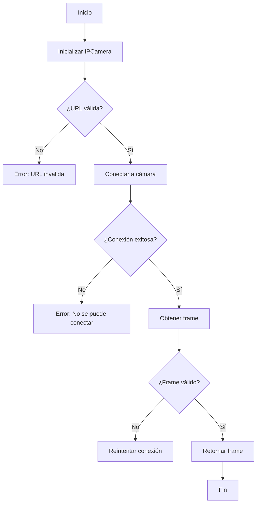
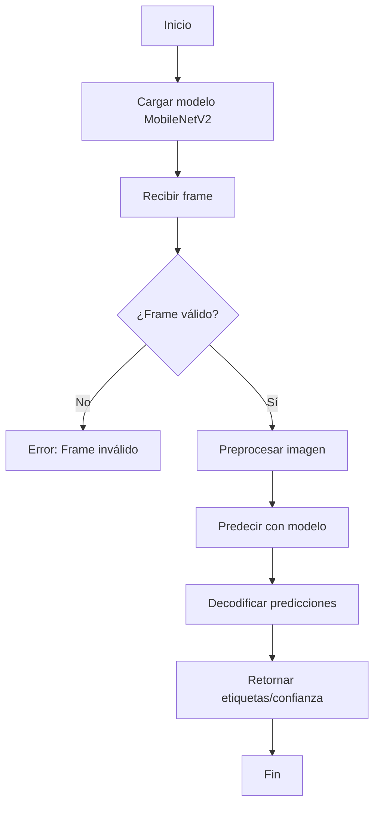
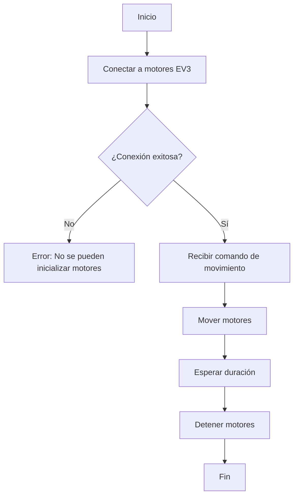
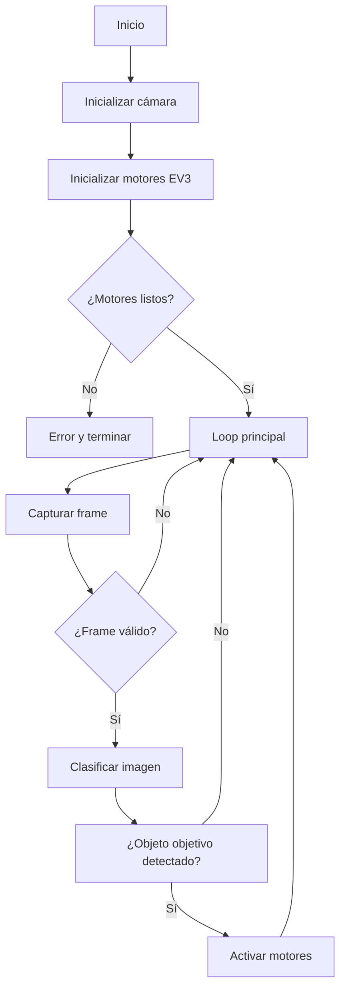

# Diagramas de flujo del proyecto vision artificial

A continuación se presentan los diagramas de flujo de los módulos principales usando el formato Mermaid. Puedes visualizar estos diagramas en VS Code con la extensión adecuada o en https://mermaid.live.

---

## 1. camera.py

---

## 2. classifier.py

---

## 3. ev3_controller.py

---

## 4. main.py

---

> Puedes copiar estos bloques en un visor Mermaid para ver los diagramas visualmente.
